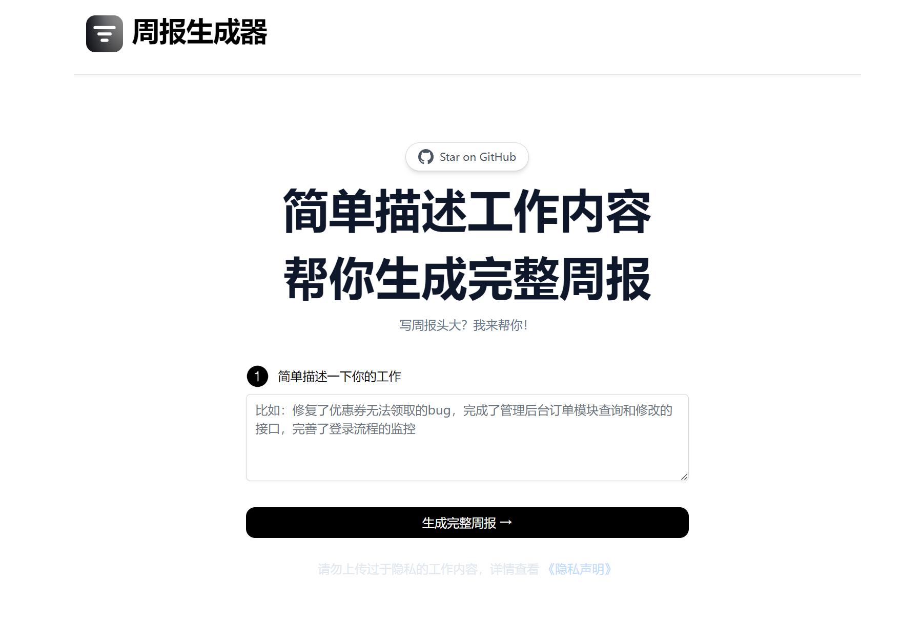

# [周报通](https://zhoubaotong.com)

## [English](README_EN.md)

简单描述工作内容，帮你生成完整周报

[](https://zhoubaotong.com)

## 这个项目是如何工作的
这个项目主要使用了 [OpenAI GPT-3 API](https://openai.com/api/) 和 [Vercel Edge functions](https://vercel.com/features/edge-functions)。它根据用户输入构建一个Prompt，通过Vercel Edge函数将其发送到GPT-3 API，然后将响应流传回应用程序。

## 在本地运行

clone此repo，去 [OpenAI](https://beta.openai.com/account/api-keys) 注册一个账号，拿到API key，放到`.env`文件。本地文件`.env.example`要改成`.env`。


确保你本地的npm命令生效，执行以下命令
```bash
npm install
npm run dev
```
打开 `http://localhost:3000`


## 线上一键部署

用 [Vercel](https://vercel.com?utm_source=github&utm_medium=readme&utm_campaign=vercel-examples) 一键部署:

[](https://vercel.com/new/clone?repository-url=https://github.com/ssrsyds/lunwen&env=OPENAI_API_KEY,NEXT_PUBLIC_USE_USER_KEY,OPENAI_MODEL&project-name=zhoubaotong&repo-name=zhoubaotong)

环境变量如下所示：
```
OPENAI_API_KEY=xxxxx
NEXT_PUBLIC_USE_USER_KEY = false  
OPENAI_MODEL = gpt-3.5-turbo
```

<!-- https://www.seotraininglondon.org/gpt3-business-email-generator/ -->

## 感谢

受 [TwtterBio](https://github.com/Nutlope/twitterbio) 和 [zhengbangbo](https://github.com/zhengbangbo/chat-simplifier) 启发.


## 声明

该项目是基于 [Weekly Report](https://github.com/guaguaguaxia/weekly_report) 进行的二次开发。
